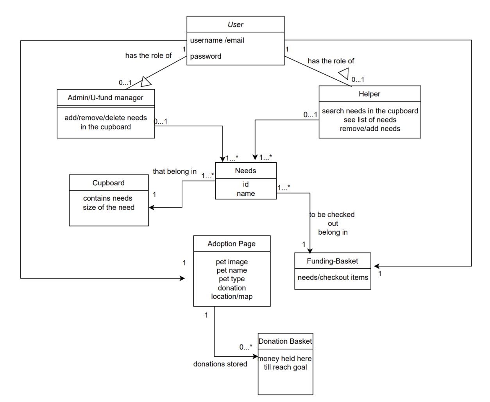
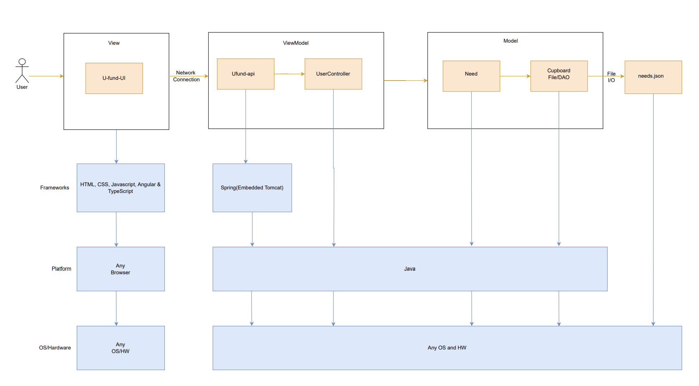
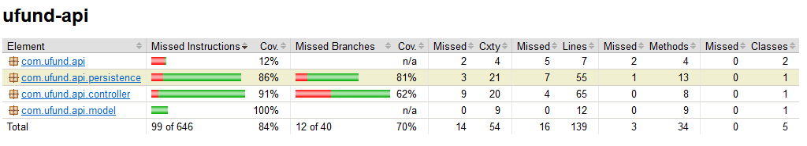
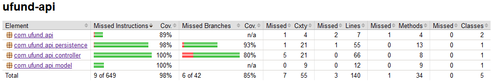
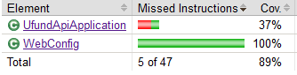
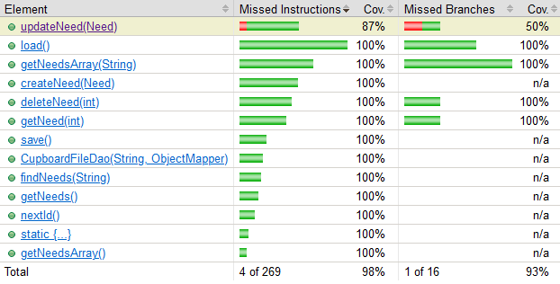
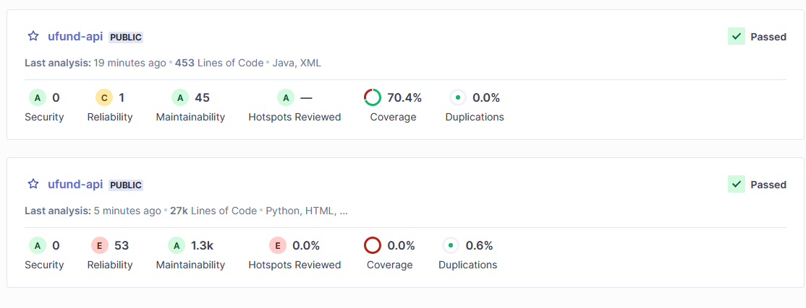
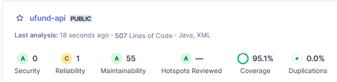

# PROJECT Design Documentation

## Team Information
* Team name: TeamAxiom
* Team members
  * Andrew Renner
  * Macca Abdi
  * Kelly Garcia
  * Jordan Ciferni
  * Justen Jiang
  * Nick Fennelly

## Executive Summary

This project is focused on making software that will assist various humanitarian and pet charities by collecting donations from crowdsourced supporters. All donations are voluntary.

### Pawsitive Connections
The purpose of this project is to develop a humanitarian website that supports pet owners and animal shelters by fulfilling their needs. Donations of all kinds are accepted, whether it be monetary or physical items.
(Macca, Jordan, Nick)

### Glossary and Acronyms

| Term | Definition |
|------|------------|
| API | Application Programming Interface - "A set of rules or protocols that enables software applications to communicate with each other to exchange data, features and functionality" -[IBM](https://www.ibm.com/topics/api#What+is+an+API%3F) |
| DAO | Data Access Object - An outline for developers in order to access persistent data in a simple and secure manner. |
| Unit Test | A small portion of the program tested with different scenarios in order to confirm its functionality. |
| Persistent Data | Data about the program stored in a file. |
| User Story | A scenario depecting a certain function that must be implemented into the program. |
| MVP | A product that is equipped with an amount of features that will satisfy early stakeholders. |
| MVC | Stands for Model-View-Controller and is an architectural pattern that separates application logic into different components. | 
| OOP | Stands for object oriented programming and is a software structure that works off of data encapsulation with resulting behaviors. |
| HTML | Stands for Hypertext Markup Language, used to structure webpage elements. |
| CSS | A style sheeting language that is used to oragnize HTML elements on a webpage. |
| UI | Stands for user interface, is used for interacting with backend mechanics that is user friendly. |
| UX | Stands for user experience, determines how satisfying and easy the product is to use and understand. |
| CI | Continuous Integration | The practice of building software such that all working pieces are merged into one branch. |
| CD | Automatically releases code changes straight to producting after passing a set of tests. |
| Git | A version control system that allows multiple developers to work on the same project efficiently. |
| REST | Stands for Representational State Transfer, and uses the standard HTTP methods (GET, POST, PUT, DELETE) |
| GET | HTTP Method to retrieve data from the server. |
| POST | HTTP Method to create new data and add it to a file on the server. |
| PUT | HTTP Method to update or replace an already pre-existing entry. |
| PATCH | HTTP Method that partially updates already existing data. |
| DELETE | HTTP Method that removes data from a file located on the server. |
(Nick, Jordan)

## Requirements

This section describes the features of the application.

| User Type | Story |
|------|------------|
| AS A developer | I WANT to submit a request to get a single need SO THAT I can access the cost, quantity, and type. |
| AS A developer | I WANT to submit a request to get all needs SO THAT I can access the cost, quantity, and type of all needs in the cupboard. |
| AS A developer | I WANT to submit a request to update a single need SO THAT I can update the cost, quantity, and/or type. |
| AS A developer | I WANT to submit a request to create a single need SO THAT I make new items with unique costs, quantities, and/or types |
| AS A developer | I WANT to submit a request to delete a single need SO THAT I remove the data that contains the cost, quantity, and type. |
| AS A helper | I WANT to be able to login to the website SO THAT I can make changes to my cart and fund various causes. |
| AS A helper | I WANT to be able to search to the website SO THAT I can find new causes to support. |
| AS A helper | I WANT to be able to login to the website SO THAT I can make changes to my cart and fund various causes. |
| AS A helper | I WANT to be able to fund different causes that are in my cart SO THAT I can checkout when I am finished browsing. |
| AS A helper | I WANT to be able to create an account on the website SO THAT I can donate to various causes. |
| AS A helper | I WANT to be able to view causes that I have previously donated to SO THAT I may be able to donate to them again in the future. |
| AS A manager | I WANT to be able to login to the website SO THAT I can make changes to various needs/causes SO THAT I can keep each cause on track. |
| Updated by: | Nick |

### Definition of MVP
A barebones version of the finished application that has enough functionality to be tested by users for the purpose of feedback.

In our case, the MVP should contain enough functionality to login, be able to view various different causes, add items to a cart, and checkout. Managers should also be able to access a cupboard that contains items currently in stock, and update these as necessary.

(Kelly, Jordan, Nick)

### MVP Features

EPIC: Needs Management

	Description: Enable developers to manage the lifecycle of needs in the system, including creating,updaing, and 		deleting a need (CRUD operations). 

	Stories: 
		AS A developer, I WANT to submit a request to get a single need SO THAT I can access the cost, quantity, and type.

		AS A developer, I WANT to submit a request to get all needs SO THAT I can access the cost, quantity, and type of all needs in the cupboard.

		AS A developer, I WANT to submit a request to update a single need SO THAT I can update the cost, quantity, and/or type.
		AS A developer, I WANT to submit a request to create a single need SO THAT I make new items with unique costs, quantities, and/or types

		AS A developer, I WANT to submit a request to delete a single need SO THAT I remove the data that contains the cost, quantity, and type.

EPIC: Helper Engagment
	
	Description: Allows helpers to discover,support,and fund causes. 

	Stories
	AS A helper, I WANT to be able to login to the website SO THAT I can make changes to my cart and fund various causes.

	AS A helper, I WANT to be able to search to the website SO THAT I can find new causes to support.

	AS A helper , I WANT to be able to login to the website SO THAT I can make changes to my cart and fund various causes.

	AS A helper, I WANT to be able to fund different causes that are in my cart SO THAT I can checkout when I am finished browsing. 

	AS A helper, I WANT to be able to create an account on the website SO THAT I can donate to various causes.

	AS A helper, I WANT to be able to view causes that I have previously donated to SO THAT I may be able to donate to them again in the future.

EPIC: Manager 

	Description: Give manager the power to delete needs, update and create needs. 

	Stories:
	AS A manager.I WANT to be able to login to the website SO THAT I can make changes to various needs/causes SO THAT I can keep each cause on track. 

 (Macca)

### Enhancements

Map View: 

With the map view, a helper find local shelters or if they want to adopt a pet, see where the animal is located. Can also be used in a way that allows users to donate and/or volunteer in person, as well as advertise the location to others.

Adoption page:

The adoption page designed to help local shelters or pet owners list their animals adoption. This is free ad-space for those looking to promote their charities and other organizations. It can be used for things like adopting pets, all the way to canned food drives.

(Macca, Nick)

## Application Domain

This section describes the application domain.

| Class | Definition | Relations |
|-------|------------|-----------|
| User | An account on the Pawsitive Connections website |  |
| Helper | A general type of user that uses the website for the purpose of providing donations | Helpers make <u>Donations</u>, Helpers edit and remove needs from their <u>Donation Basket |
| Admin | An administrative type of user that can manage the website as they see fit | Admins manage the need <u> Cupboard |
| Donation | Stores the information about the needed donation, such as what the product is, and the quanitity of the product needed | Donations go to <u>Shelters/Domesticated Animals</u>, Donations are stored in the <u>Donation Basket</u> |
| Donation Basket | Stores the Donations selected by the Helpers | Donations in the basket go to fulfilling <u>Needs</u> |
| Cupboad | Stores needs on the website that can be selected by Helpers or edited by Admins |  |
| Need | Donation items required by Shelters/Domesticated Animals | Needs are stored in the <u>Cupboard</u> |
| Shelters/Domesticated Animals | The organizations and/or individual animals that require items in the form of donation |  |

## Architecture and Design

This section describes the application architecture.

### Summary

The following Tiers/Layers model shows a high-level view of the webapp's architecture. 

The web application, is built using the Model–View–ViewModel (MVVM) architecture pattern. 

The Model stores the application data objects including any functionality to provide persistance. 

The View is the client-side SPA built with Angular utilizing HTML, CSS and TypeScript. The ViewModel provides RESTful APIs to the client (View) as well as any logic required to manipulate the data objects from the Model.

Both the ViewModel and Model are built using Java and Spring Framework. Details of the components within these tiers are supplied below.

### Overview of User Interface

This section describes the web interface flow; this is how the user views and interacts with the web application.

### View Tier
> _**[Sprint 4]** Provide a summary of the View Tier UI of your architecture.
> Describe the types of components in the tier and describe their
> responsibilities.  This should be a narrative description, i.e. it has
> a flow or "story line" that the reader can follow._

PASITIVECONNECTIONS is designed to guide users seamlessly through their tasks. Users begin their journey on the homepage, which allows them to sign in with an email and password. Users can navigate the Cupboard or use the search feature to find needs they want to fulfill. Helper can go to the adoption page and see various pets and the description of the pet including their age, gender, and name. If a user is interested in the pet the helper can see a map view of how far the pet is for adoption. Users engage with the platform through the Messages component for updates and confirmations, proceeding to donate via their carts. For account management, users can recover access using the Forget Password page if a user forgets their password.

Sequence Diagrams 

UML

### ViewModel Tier

The classes supporting the uFundAPI are found in the UserController class. The UserController houses five methods to support it.

1. getNeed() - Retrieves a single need as input from the cupboard.
2. getNeeds() - Retrieves a full list of all needs in the cupboard.
3. searchNeeds() - Finds a need containing a substring as input by the user / developer.
4. createNeed() - Creates a new need with data input from the user/developer.
5. updateNeed() - Updates an existing need using data passed through by the user/developer.
6. deleteNeed() - Deletes a need using the passed through ID.
Updated by Nick

The UserController is designed to handle incoming HTTP requests, interact with the Model tier, and return an HTTP response. It ensures smooth communication between the front end and backend.

Class in the ViewModelTeir

### Model Tier

We use the Need class to interact with various needs, as in when a need has to be updated or created. The ID can be found by calling on it using methods from this class.

The CupboardDAO and CupboardFileDAO classes are used to interact with the cupboard found in a respectively named JSON file. These files will interpret the data and return it to the developer attempting to access this data. It is a means of persistence when updating/creating/deleting data.
Updated by Nick

## OO Design Principles

We have worked to implement single responsibility and low coupling into our project. This way, our classes only have one purpose in the project and do not become too overburdened. Our hope is to have a fluid program that has many moving parts, but work in high cohesion. As for low coupling, we have worked to ensure that we are not accessing classes unnecessarily to achieve a similar goal. We have refactored our project for this purpose.
Updated by Nick

View Teir

>

View Model Teir

Model tier

## Static Code Analysis/Future Design Improvements

This is our first run through using JaCoCo. The results indicate that we only managed to reach a coverage of around 84%, which is not ideal. This is the amount that our project would stay at between Sprints 1-3.

In Sprint 4, we managed to increase the coverage all the way to 98%, only missing a few key components. This was a solid improvment, and was evidence that our program was operating well.

 

These were the two issues that stopped us from getting to the 100% coverage. In the first image, the issue is in the UfundApiApplicationTest suite, and an odd error was preventing these tests from completing. On the other hand, the second picture, the one that details the updateNeed() method, shows that a small "null" checking error prevents this code from being fully covered. We assume that these issues are easy fixes, although we have not managed to find a solution. These issues are small, and do not impact the program in a large way.

## Testing

This section of our project goes over the process of our testing, and how these tests influenced our overall project.

### Acceptance Testing

| User Type | Story |
|------|------------|
| Get a  Need | Passed testing, user story has been successfully implemented. |
| Get all Needs | Passed testing, user story has been successfully implemented. |
| Create a new Need | Passed testing, user story has been successfully implemented. |
| Update a Need | Passed testing, user story has been successfully implemented. |
| Delete a Need | Passed testing, user story has been successfully implemented. |
| Search for a Need | Passed testing, user story has been successfully implemented. |
| Login Page | Passed testing, user story has been successfully implemented. |
| Website Front Page | Passed testing, user story has been successfully implemented. |
| Updated by | Nick |

### Unit Testing and Code Coverage

Sprint 2:

- As of right now, our code coverage is rather lack luster. We have not been able to setup many tests for our current web application, hence the 0% coverage checks on the UI.
- On the contrary, our backend application has a higher score but not an optimal one, around 70%. We will work on improving this score to create a more cohesive application.
- Updated by Nick

Sprint 3:
- Due to the recent build failure of the spring boot getting our code coverage is challenging at the moment. All tests are implemented and successfully passed.
- updated by Macca A. 

Sprint 4:

Final Code Coverage Improvements

In our first code coverage report, we were missing a few pieces that caused us to receive a low score of around 70%. These were issues that we were going to address, in order to make sure that our projects worked as smoothly as possible. We also managed to index our UI in this test, although these tests are (assumed) not required. This is the reason behind the 0% coverage status.

In our final code coverage report, we saw a great improvement over 25%. These tests streamlined the process of checking our new features. The only missing pieces that prevented us from achieveing a 100% score were the test that checks that the UI can start, and a small null value check in our API. These things are most likely easy to be fixed, and would not cause serious harm to the program. The most important pieces functioned properly, giving us a high score.

In the future, we would take care of these issues to make sure that we are operating at peak performance.

(Nick)

### Recommendations for Improvement

Over the course of this project, we encountered some issues. The biggest issue that we had out of the gate was with Angular, as our Java backend went pretty smooth.

1. Angular: Standalone and AppModule
- This was the biggest issue for us, and ultimately caused us to overhaul our project just days before a demo was due. The issue arose when we wanted to connect different pieces of our project together, but encountered the tedious challenge of having standalone/non-standalone components that were not compatible with each other. After some debugging, we managed to fix the login page connection, although this was just a small piece in a much bigger puzzle. At the end of our discussions, we found it to be much easier to start from the ground up and incorporate our old features into the new project based around the TourOfHeroes tutorial program. By doing so, we also managed to clean up a lot of the grammatical issues like improper variable and class names. Furthermore, it also allowed us to successfully implement our new features with the old and not have to deal with the standalone bugs.

2. Code Coverage
- Our code coverage was significantly lower than we wanted it to be coming out of Sprint 2. This is something we changed in Sprint 3 by implenting a more comprehensive suite of unit tests to almost fully cover all of the bases. To improve here, we did miss some small, but not functionality threatening tests, as detailed in the code coverage sections. 

At a glance, there needs to be an additional null check in the updateNeed() method, as well as a test for the starting of the Angular program, which for some reason returns a red flag when running the tests.

## Ongoing Rationale
>_**[Sprint 1, 2, 3 & 4]** Throughout the project, provide a time stamp **(yyyy/mm/dd): Sprint # and description** of any _**mayor**_ team decisions or design milestones/changes and corresponding justification._

Sprint 1: n/a

Sprint 2: Implement basic UI, note that we did not use AppModule in this build, and standalone was included.
Sprint 3: Realized that implementing these features with standalone and without AppModule would be much harder than we though, decided to completely overhaul the code base and translate towards the "TourOfHeroes" UI that was built from the tutorial.
Sprint 4: Minor bug fixes, nothing major changed during this sprint.
